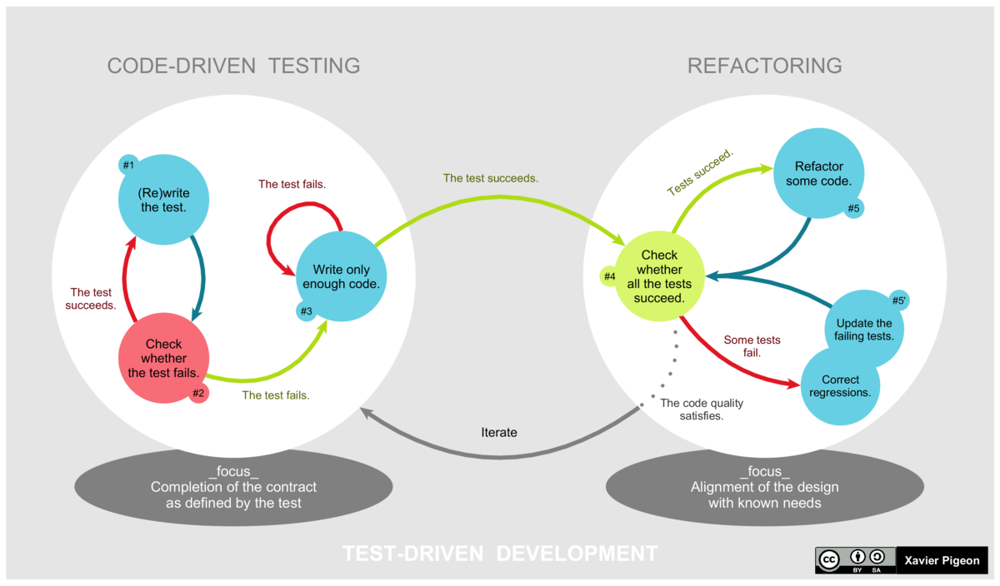

Assignment 1 in IN3240/IN4240

Part 1
======
TODO "see the accompanying .java and .html files"

Part 2
======

https://docs.sonarqube.org/display/SONAR/User+Guide

https://sonarcloud.io/about/sq

Task 0
* Tried to do option 3, but the process was like hell on earth
  * The invasive system of sonarcloud wants way to many permissions
  * One has to download proprietary buildwrapper and scanner
  * Running the buildwrapper fails with `LD_PRELOAD cannot be preloaded`
  * Hardly worth the suffering
* https://github.com/byllgrim/svi
* https://sonarcloud.io/dashboard?id=byllgrim_svi

```
INFO: Analysis total time: 8.708 s
INFO: ----------------------------------------------------------------------
INFO: EXECUTION SUCCESS
INFO: ----------------------------------------------------------------------
INFO: Total time: 10.305s
INFO: Final Memory: 30M/369M
INFO: ----------------------------------------------------------------------
```

Task 1
1.1  The metrics of a quality gate are checkpoints, that your program needs to pass before the release.

1.2:
1.2.1 Bugs are logic failures or syntax failures resulting in that your program will not be able to execute.
1.2.2 Vulnerabilities are security weaknesses that can be used by bad actors.
1.2.3 Code Smells are indications that there is a deeper problem in the system
1.2.4 Blocker are issues that you absolutly need to fix, before continuing.
1.2.5 Coverage is the extent to which you have exercised the code.

1.3:
1.3.1: 0 
1.3.2: 0
1.3.3: 22

Task 2
2.1: Code smell: 1. "Reduce the number of nested break and goto statements from 2 to 1 authorized." 
It complains because loops should not have more than one break.

Code smell 2."Complete the task associated to this "TODO" comment."
It complains because it tracks TODO tags.

Code smell 3."Add a "default" case to this switch statement."
Default in a switch case is required to protect the system form future additions to enum.

Code smell 4. "Define each identifier in a dedicated statement."
The declarations may be confusing regarding type.


2.2:/* TODO: svar på løsning, code smell:1 */ 
Code smell 2: You just need to complete the task in the TODO comment,
code smell 3: Adding a default case will solve the issue.

Code smell 4: Declare the type on each line, separately.


Task 3

3.1 
3.1.1 A False-positive is an issue pointed out by the analytics tool, but the developer means it is not an issue.
3.1.2  False-negative is the inverse of 3.1.1.

3.2  A example of a false-positve is the code smell 4: "Define each identifier in a dedicated statement".
 A example of a false-negative is old comments referring to old code.


Part 3
======

Easy task
* Session id: `eDxgXL`
* https://cyber-dojo.org/kata/edit/eDxgXL

Hard task
* Session id: `bftdZb`
* https://cyber-dojo.org/kata/edit/bftdZb

We tried to follow this cycle:


Part 4
======
